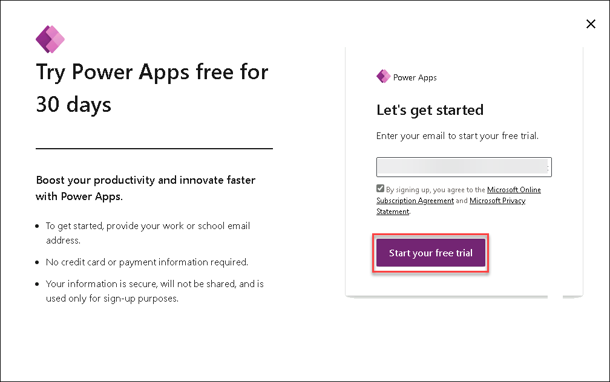

# Course Introduction
 
> - Common Data Service has been renamed to Microsoft Dataverse. You can refer to the following link for more details: `https://aka.ms/PAuAppBlog`
> - Some terminology in Microsoft Dataverse has been updated. For example, *entity* is now *table* and *field* is now *column*. For more details, navigate to: `https://go.microsoft.com/fwlink/?linkid=2147247`
 
## Exercise 1: Acquire a Power Platform trial tenant
 
## Lab Scenario
 
In this lab, you will acquire a Power Platform trial tenant and access the Power Platform admin center. In the admin center, you will create an individual environment for use during the rest of the course. You will need **Microsoft 365 credentials** provided by the Authorized Lab Hoster, or otherwise.
 
## Lab Objectives
 
Though this lab, you will be able to complete and gain insights into the following exercises:
 
-  Exercise 1: Acquire a Power Platform trial tenant
-  Exercise 2: Create your environment
 
### Exercise 1: Acquire a Power Platform trial tenant
 
1.  Navigate to [Power Apps](https://powerapps.microsoft.com/) and select **Start free**.

      
 
3.  Enter the email address from the provided Microsoft 365 credentials. Agree to the terms & conditions then select **Start your free trial**.
 
4.  You will see a prompt that you have an existing account with Microsoft. Select **Sign in**.
 
5.  Enter the password provided by the Authorized Lab Hoster.
 
6.  Select **Yes** to stay signed in.

      
 
8.  If applicable, read through the prompts by selecting **Next**, then select **Let's Go**.
 
    > **Note:** If you encounter an error: "Sorry, there's been a disconnect", you can follow the steps below. If not, you can continue to **Exercise 2**.
>
> 1. Navigate to [Power Apps Maker Portal](https://make.powerapps.com).
> 2. Select the **Gear Icon** (Settings) from top-right corner on the header of the page.
> 3. Select **Plan(s)** and verify if you have **Power Apps Per User Plan Trial**. 
> 4. If you do not have the above license, repeat **Exercise 1**. Otherwise, proceed to **Exercise 2**.
 
 
### Exercise 2: Create your environment
 
In this exercise, you will create a **Practice** environment that you will use to do the majority of the lab work in this training.
 
#### Task 1 – Create environment
 
1.  Open a new browser tab and navigate to the Power Platform admin center `https://aka.ms/ppac` 
2.  Log in with your Microsoft 365 credentials, if prompted again.
 
3.  Skip the welcome tour by closing the prompt, or select **Get Started** to begin the tour and select **Next** through each prompt. At the end, select **Done** to finish the tour.
   
      
 
5.  Select **Environments** from the site navigation and select **+ New** from the toolbar.
 
6.  For **Name**, enter **[your initials] Practice**. (Example: `AJ Practice`) 
7.  For **Type**, select **Trial**. 
8.  Change the toggle on **Add a Dataverse data store?** to **Yes**. Leave all other selections as default and select **Next**.
 
9.  On the **Add Dataverse** tab, under **Security group** use the **+ Select** button, and under **Open access**, select **None**.
10.  Select **Done** and select **Save**.
 
11. In the list of environments, your **Practice** environment should now show as **Preparing**.
 
    Your practice environment will take a few minutes to provision. Refresh the **Environments** list if needed.
 
12. When your environment shows as **Ready**, select your **Practice** environment by selecting the ellipses next to the name to expand the drop-down menu and select **Settings**.
 
13. Explore the different areas in **Settings** that you are interested in but do not make any changes. 
