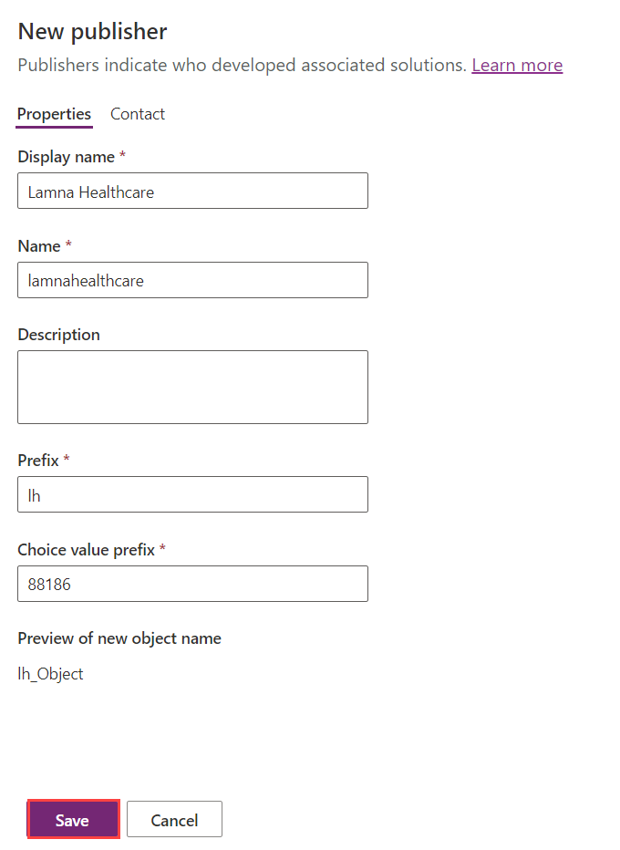
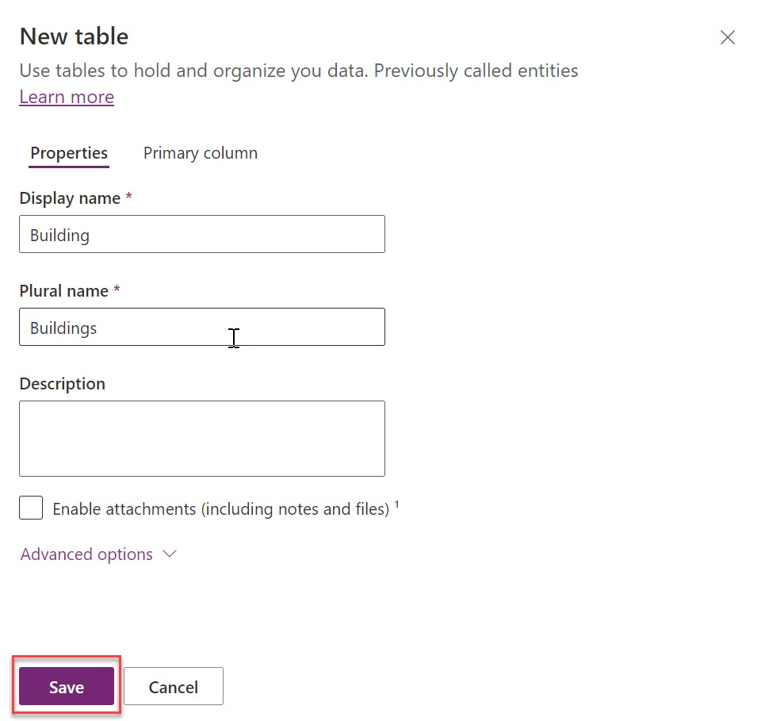
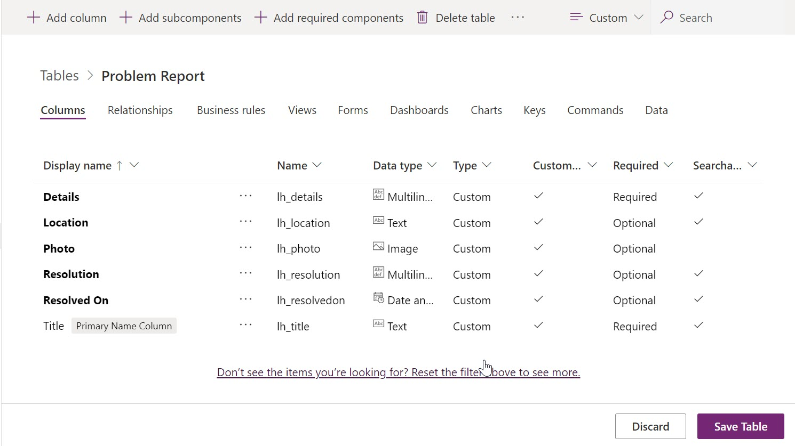
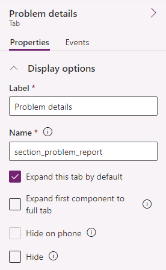
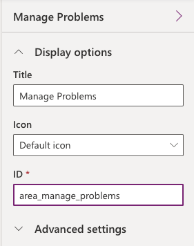
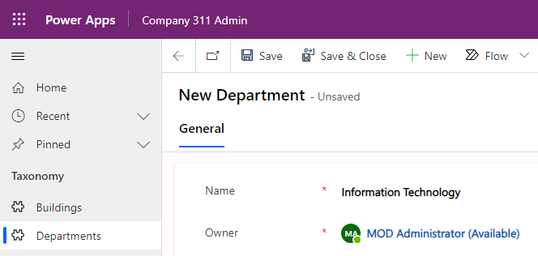
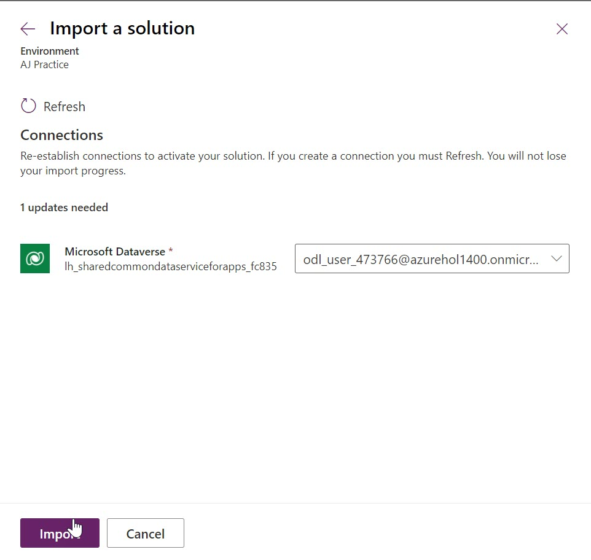
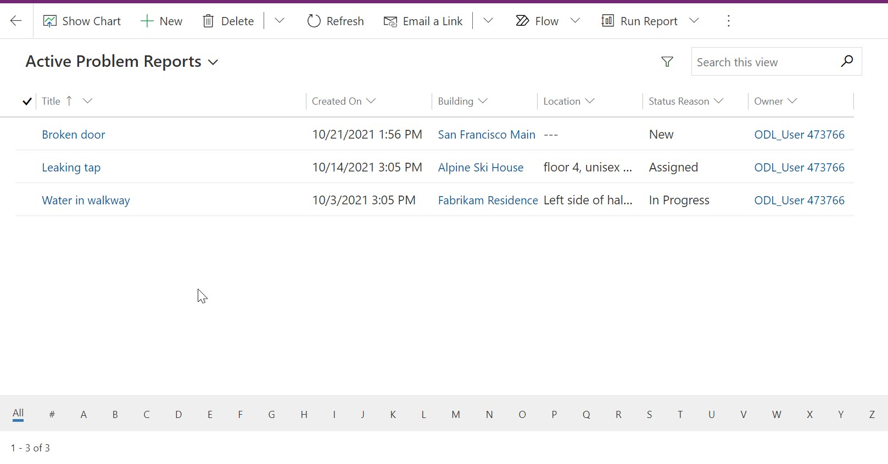
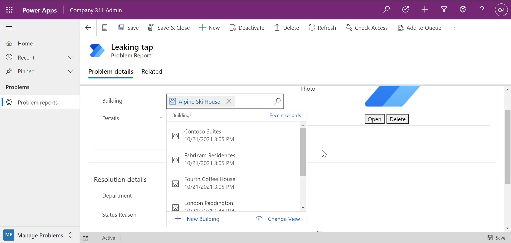

# Lab 02.1: Data model and model-driven app

In this lab you will be implementing the data model for the solution and building a model-driven app that will be used for fixing problems or managing the overall effort.

## What you will learn

  - Create Tables, Columns, and relationships

  - Create a model-driven app

  - Create a site map

  - Create and configure Table forms

  - Create and configure Table views

## High-level lab steps

  - Exercise 1 – Create publisher and solution  

  - Exercise 2 – Implement the data model 
    
      - Data Model 
        
          - Building 
          
          - Department 
          
          - Problem Report 

  - Exercise 3 – Configure forms and views 

  - Exercise 4 – Compose a basic model-driven app 

  - Exercise 5 – Input data and refine some views, import some problem reports 

## Detailed steps

### Exercise 1: Create publisher and solution

In this exercise, you will create a custom solution publisher and a solution. This solution will be used in all the labs for this course to keep all the components together.

#### Task 1: Create publisher and solution

1.  Navigate to the [Power Apps maker portal](https://make.powerapps.com/) and make sure you are in the practice environment you created.

1.  Select **Solutions** and click **+ New solution**.

1.  Enter **Company 311** for **Display name**.

1.  Click on the **+ New Publisher**, under the **Publisher** option.

    

1.  Enter **Lamna Healthcare** for **Display name**, **lamnahealthcare** for **Name**, **lh** for **Prefix**, **88186** for Choice value prefix, and click **Save**.

    

1.  Click on the **Publisher** dropdown and select the **Lamna Healthcare** publisher you created.

1.  Click **Create**.

    

1.  You should now see the solution you created in the solution list.

    

### Exercise 2: Implement data model

In this exercise, you will create Tables, Columns, and the Relationships you identified when you designed the data model for the Company 311 app.

#### Task 1: Create Tables

1.  In the [Power Apps maker portal](https://make.powerapps.com/) select **Solutions** and click to open the **Company 311** solution you created in Exercise 1.

1.  Click **+ New** and select **Table**.

1.  Enter **Building** for **Display name** and click **Save**.

    

1.  Go back to the solution by clicking on the back arrow .

    
    
1.  Select Solutions and click to open the Company 311 solution

1.  Click **+ New** and select **Table** again.

1.  Enter **Department** for **Display name** and click **Save**.

    

1.  Click **+ New** and select **Table** one more time.

1.  Enter **Problem Report** for **Display name**, on the **Primary Column** tab, enter **Title** for **Display Name**.

    

1. On **Properties** tab, click **Advanced Options**.

1. Under **Rows in this table**, Check the **Can be added to a queue** checkbox and click **Save**. Enabling queues allows Problem Report Rows to be associated with one or more queues to help facilitate routing to the different departments.

#### Task 2: Add Columns

In this task, you will add Columns to the Problem Report Table.

1.  Navigate to the [Power Apps maker portal](https://make.powerapps.com/) page and make sure you are in the correct environment.

1.  Select **Solutions** and click to open the **Company 311** solution you created in exercise 1.

1.  Locate and click to open the **Problem Report** Table.

    

1.  Select the **Columns** tab and click **+ Add Column**.

    

1.  Enter **Location** for **Display name**, select **Text** for **Data type**, and click **Advanced options**.

    

1.  Change **Max length** to **150** and click **Done**.

    

1.  Click **+ Add Column** again.

1.  Enter **Details** for **Display name**, select **Multiline text** for **Data type**, make the Column **Required**, and click **Done**.

    

1.  Click **+ Add Column** again.

1. Enter **Photo** for **Display name**, select **Image** for **Data type**, and click **Done**.

1. Click **+ Add Column**.

1. Enter **Resolution** for **Display name**, select **Multiline text** for **Data type**, and click **Done**.

1. Click **+ Add Column**.

1. Enter **Resolved On** for **Display name**, select **Date and time** for **Data type**, and click **Done**.

1. Click **Default** Filter and select **Custom**. (For small screen devices, default dropdown goes into the **ellipsis**).

    

1. You should now see the 5 new Columns you created. Click **Save Table**.

    

1. Go back to the solution by clicking on the back arrow.

    
        
1. Click **Publish all customizations** and wait for the publishing to complete.

1. Do not navigate away from this page until all customizations have been published successfully.

#### Task 3: Edit status reason Choice

In this task, you will edit the status reason Column of the problem report Table.

1.  Make sure you are in the **Company 311** solution.

1.  Click to open the **Problem Report** Table.

1.  Click on the **… More commands** button and select **Switch to classic**.

    **NOTE:** You are switching to classic because the modern solution explorer does not support editing status reason yet but will in the future.

    

1.  Select **Fields** and look for **Status Reason** in the Display Name column, double click to open the **Status Reason** Column.

    **NOTE:** If the pop-ups are not enabled on the browser, the pop-up window for updating the column will not open. Make sure that you have enabled open popups and redirects on the browser tab. 

5.  Make sure **Active** is selected for **Status** and double click to open the **Active** option.

6.  Change the **Label** value to **New** and click **OK**.

7.  Click **Add**.

8.  Enter **Assigned** for **Label** and click **OK**.

9.  Click **Add** again.

10. Enter **In Progress** for **Label** and click **OK**.

11. Click **Add** again.

12. Enter **Completed** for **Label** and click **OK**.

13. Click **Add** one more time.

14. Enter **Won’t Fix** for **Label** and click **OK**.

15. You should now have 5 options. Select **New** for **Default Value** and click **Save and Close**.

16. Click **Publish** and wait for the publishing to complete.

17. Click **Save and Close** to close the classic editor.

18. You should now be back on the **Power Apps Maker** portal.

#### Task 4: Relationships

In this task, you will create many to one relationships between the problem report Table and the building and department Tables.

1.  Make sure you are in the **Problem Report** Table.

1.  Select the **Relationships** tab and click **+ Add relationship**.

    

1. Select **+ Many-to-one**.

    

1.  Select **Building** for **Related (One) Table** and click **Done**.

    

1.  Click **+ Add relationship** again.

1.  Select **+ Many-to-one**.

1.  Select **Department** for **Related (One) Table** and click **Done**.

1.  Click **Save Table**.

1.  Go back to the solution by clicking on the back arrow.

1. Click **Publish all customizations** and wait for the publishing to complete.

### Exercise 3: Configure form and views

In this exercise, you will configure form and views for the problem report Table.

#### Task 1: Configure form

1.  Navigate to the [Power Apps maker portal](https://make.powerapps.com/) and make sure you are in the correct environment.

1.  Select Solutions and click to open the **Company 311** solution.

1.  Locate and click to open the **Problem Report** Table.

1.  Select the **Forms** tab and click to open the **Information** form of type **Main**.

    

1.  Use the Zoom control at the bottom of the form to make the form large enough for you to work easily. Select the **form section**.

    

1.  Go to the **Properties** pane, change the **Label** to **Problem details**, and enter **section\_problem\_report** for **Name**.

    

1.  While you still have the section selected, go to the **Table Columns** pane, and click on the **Building** Column. The Building Column will be added to the form.

    

1.  Add the **Details**, and **Photo** Columns to the form.

1.  Your form should now look like the image below. Select the **Details** Column.

    

1. Go to the **Properties** pane and click to expand the **Formatting** section.

    

1. Change the **Form field height** to **4**.

    

1. Select the **Components** from the toolbar.

    

1. Select **1-Column section.**

    

1. A new section should be added to the form. Select the **new section**.

    

1. Go to the **Properties** pane, change the **Section label** to **Resolution details**, and enter **section\_resolution\_details** for **Name**.

    

1. Select **Table columns** from the toolbar.

1. Add **Department**, **Status Reason**, **Resolved on**, and **Resolution** Columns to the **Resolution details** section.

    

1. Select the **Resolution** Column.

1. Go to the **Properties** pane and click to expand the **Formatting** section.

1. Change the **Form field height** to **4**.

1. You form should now look like the image below. Click **Save**.

    

1. Click **Publish** and wait for the publishing to complete.

1. Click on the **<- Back** button.

    

1. You should now be back to the Table.

#### Task 2: Edit view

1.  Select the **Views** tab and click to open the **Active Problem Reports** view.

    

1.  Click **+ View column** and select **Building** to add the **Building** column to the view.

    

1.  Add **Location**, **Status Reason**, and **Owner** columns to the view.
    You will have to change the column filter to **All** when adding status reason and owner columns.

    

1.  Go to the view properties pane and click **Edit filters**.

    

1.  Update the existing filter and set it to **Status Reason Equals New**.

1.  Click on the Column where **New** is selected.

    

1.  Select **Assigned**.

    

1.  Click on the column again and select **In progress**.

1.  The filter should now look like the image below. Click **OK**.

    

1. Click **Save**.

#### Task 3: Create view from existing

In this task, you will create a new view from the Active Problem Reports view.

1.  Click **Edit filters**.

    

1.  Remove **In Progress** from the filter.

    

1.  Remove **Assigned** and **New** values form the filter.

1.  Select **Completed**.

    

1.  Add **Won’t Fix** and **Inactive** values to filter.

1.  The filter should now look like the image below. Click **OK**.

    

1.  Click on the dropdown button next to the save button and select **Save As**.

    

1.  Enter **Resolved Problems** for **Name** and click **Save**.

    

1.  Click on the **Back Button** of your browser to go back to the **Solutions**.

    

1. Go to the solution by clicking on the back arrow.

1. Click **Publish all customizations** and wait for the publishing to complete.

    

### Exercise 4: Compose model-driven application

In this exercise, you will create model-driven application.

#### Task 1: Create new model-driven application

1.  Navigate to the [Power Apps maker portal](https://make.powerapps.com/) and make sure you are in the correct environment.

1.  Select Solutions and click to open the **Company 311** solution.

1.  Click **+ New | App | Model-driven app**.

    

1.  Select **Modern app designer(Preview)** and click **Create**.

1.  Enter **Company 311 Admin** for name and click **Create**.

    

1. Select **Navigation** from left menu.

    

1. Select the **Area1**.

    

1. Go to the **Properties** pane, enter **Manage Problems** for **Title**, and enter **area\_manage\_problems** for **ID**.

    

1. Select the **Group1**.

    

1. Go to the **Properties**, enter **Problems** for **Title**, and enter **group\_problems** for **ID**.

1. Select the **Subarea1**.

1. Go to the **Properties** pane, select **Table** for **Content Type**, and select **Problem Report** for **Table**, and enter **Problem reports** for **Title**.

    

    **Note:** The new app designer doesn't provide a way to add new sitemap area yet.

1. Click **Save**.

1. Click **Switch to classic**

    

1. Select **Save and Continue**.

   **Note:** If the pop-ups are not enabled on the browser, the classic view will not open. Make sure that you have enabled open popups and redirects on the browser tab. 

    

1. Click **Edit** on the Site Map.

    

1. Click **+ Add** and select **Area**.

   

1.   Select the **New Area** you just added.

1. Go to the **Properties** pane, enter **Settings** for **Title**, and enter **area\_settings** for **ID**.

    

1.  Click **Save and close** to close the sitemap editor.

1.  Click **Save and close** again to close the classic app designer.

1. You should now be back to the new app designer. **Refresh** the browser. Switch to **Navigation** menu.

1.  The new **Settings** area should now be visible in the new app designer. Select the **Setting** area.

1. Click **+ Add** and select **Group**.

    

1.  Select the **New Group** you just added.

1.  Go to the **Properties** pane, enter **Taxonomy** for **Title**, and enter **group\_taxonomy** for **ID**.

    

1.  Select the **Taxonomy** group you just added, click **+ Add** and select **Subarea**

    

1.   Select **Table** for **Content type**, **Building** for **Table** and click **Add**.

     

1.  Select the **Taxonomy** group, click **+ Add** and select **Subarea** again.

1.  Select **Table** for **Content type**, select **Department** for **Table**, and click **Add**.

1. The sitemap should now look like the image below. Click **Save** to save the sitemap.

    

1. Click **Publish** to publish the sitemap and wait for the publishing to complete.

1. **Close** the browser tab. 
 
1. Open a new tab and navigate to the [Power Apps maker portal](https://make.powerapps.com/) and make sure you are in the correct environment.

1. Select Solutions and click to open the **Company 311** solution.
 
1. Click **Publish all customizations** and wait for the publishing to complete.

    

### Exercise 5: Input data

In this exercise, you will input data to the Dataverse tables.

#### Task 1: Input data

1.  Navigate to the [Power Apps maker portal](https://make.powerapps.com/) and make sure you are in the correct environment.

1.  Select **Apps** and click to open the **Company 311 Admin** application you created.

    

1.  Click **Change area**.

    

1.  Select **Settings** area.

1.  Select **Departments** and click **+ New**.

    

1.  Enter **Facility Maintenance** for **Name** and click **Save**.

    

1.  Click **+ New** again.

1.  Enter **Human Resources** for **Name** and click **Save**.

1.  Click **+ New** one more time.

1. Enter **Marketing** for **Name** and click **Save**.

1. Select **Departments**.

1. You should now have three department Rows. Select **Buildings**.

    

1. Click **+ New**.

1. Enter **San Francisco Main Campus** for **Name** and click **Save & Close**.

1. Click **+ New** again.

1. Enter **London Paddington** for **Name** and click **Save & Close**.

1. You should now have two building Rows. Click **Change area**.

    

1. Select **Manage Problems**.

1. Click **+ New**.

    

1. Enter **Broken door** for **Title**, select **San Francisco Main Campus** for **Building**, enter **The main entrance door will not open all the way** for **Details**, and click **Save**

    

1. Click on the **Photo** Column.

    

1. Select an image from your device. The sample image displayed below can be found [here](02-1/media/image89.png).

1. The image should now show on the form.

    

1. Click **Save & Close**.

1. Close the browser tab.

### Exercise 6: Import data

In this exercise, you will import sample data into the environment. Rows are imported by a Power Automate cloud flow that you will first import using a solution.

#### Task 1: Import solution

1.  Navigate to the [Power Apps maker portal](https://make.powerapps.com/) and make sure you are in the correct environment.
 
1.  Select **Solutions** and click **Import**.
 
1.  Click **Browse**.

1.  Select the **DataImport.zip** solution file located in the lab resources folder and click **Open**.
  
1.  Click **Next**.
  
1.  Click **Next** again.
  
1.  Expand **Select a connection** dropdown and click **+ New connection**.
  
1.  New tab will open with a prompt to create **Microsoft Dataverse** connection. 

    
  
1.  Click **Create**, authenticate if required, wait until new connection is created. Close the browser tab.
  
1.  Click **Refresh**. Make sure new connection is selected in the dropdown. 
  
1.  Click **Import** and wait for the message **Solution "Data Import" imported successfully** to appear.
  
1.  Click **Publish all customizations** and wait for the publishing to complete. 

#### Task 2: Review and run flow

1. Navigate to the [Power Apps maker portal](https://make.powerapps.com/) and make sure you are in the correct environment.

1. Select **Solutions** and click to open the **Data Import** solution you imported.

1.  Click to open the **Import Data** flow. Click the **Get Started** button on the **Welcome to Power Automate** window.

    **Note:** If the flow is not opened after clicking on Get Started, then close the current tab, go back to your previous window, click Done and reopen the flow.

    

1.  Click **Edit**.

1.  Click to expand the **Input** **Data** step.

1.  Review the JSON text in the value Column. This is the data that will be imported into your environment. Note the image data encoded as a text.

1.  Expand the **Each Department** for each control

1.  Expand and review the **Upsert Department** step.

1. Expand and review the rest of the steps.

1. Click **Save** to save the flow.

1. Click on the button and go back to the flow details page.

    

1. Click **Run**.

1. Click **Run flow**.

1. Click **Done**.

1. Wait for the flow run to complete. Click on the **Refresh** button to check if the flow run completed successfully.

    

1. Close the flow editor browser window or tab.

1. Click **Done** on the popup

#### Task 3: Review imported data

1.  Navigate to the [Power Apps maker portal](https://make.powerapps.com/) and make sure you are in the correct environment.

1.  Select **Apps** and click to open the **Company 311 Admin** application.

1.  Select Problem Reports. You should see at least two new Rows.

    

1.  Click to open one of the **Problem Report** Rows.

1.  Click on the **Search** icon of the **Building** lookup and make sure building Rows were imported.

    

1.  Scroll down and click on the **Department** lookup.

1.  Make sure the department Rows got imported.

### **Bonus exercise**

  - Deal with problem report assignment within a department.
