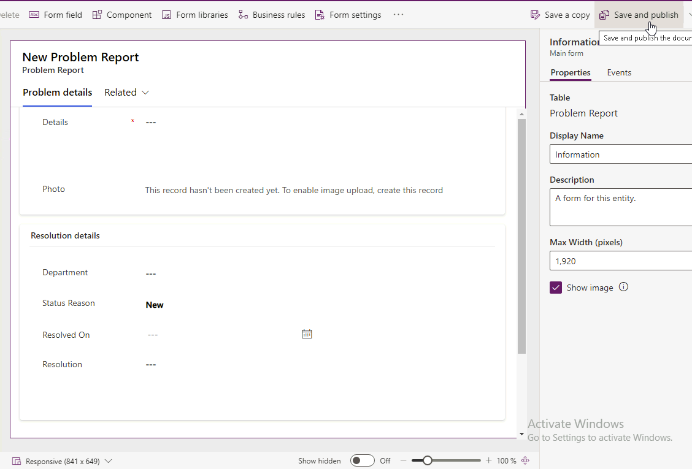
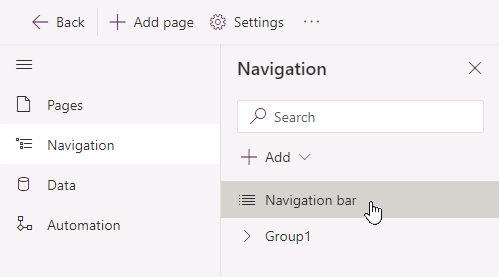
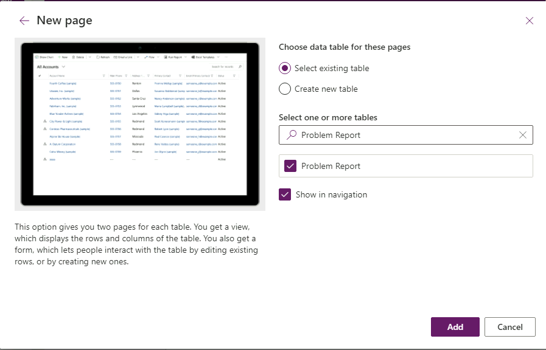
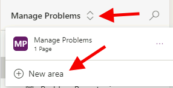
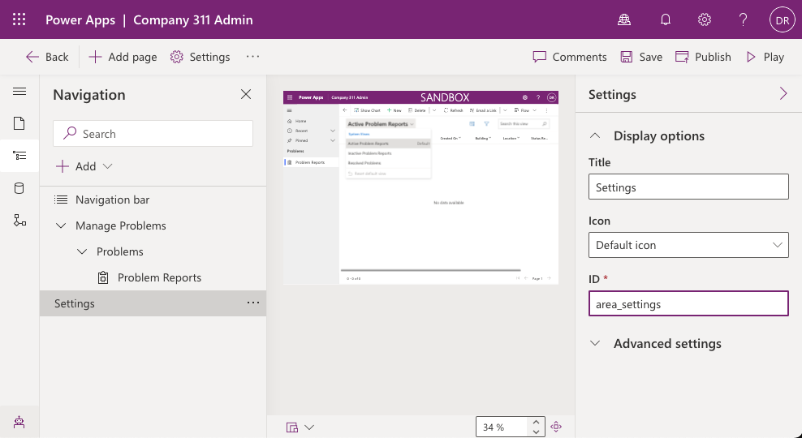
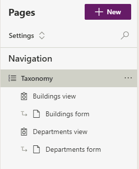

---
lab:
    title: 'Lab 02.1: Data model and model-driven app'
    module: 'Module 02: Create a model-driven app'
---

> **NOTE**
>
> Effective November 2020:
> - Common Data Service has been renamed to Microsoft Dataverse. [Learn more](https://aka.ms/PAuAppBlog)
> - Some terminology in Microsoft Dataverse has been updated. For example, *entity* is now *table* and *field* is now *column*. [Learn more](https://go.microsoft.com/fwlink/?linkid=2147247)
>


# Lab 02.1: Data model and model-driven app

In this lab you will be implementing the data model for the solution and building a model-driven app that will be used for tracking problems and managing the overall effort.

## What you will learn

  - Create Tables, Columns, and relationships

  - Create a model-driven app

  - Create a site map

  - Create and configure Table forms

  - Create and configure Table views

## High-level lab steps

  - Exercise 1 – Create publisher and solution  

  - Exercise 2 – Implement the data model 
    
      - Data Model 
        
          - Building 
          
          - Department 
          
          - Problem Report 

  - Exercise 3 – Configure forms and views 

  - Exercise 4 – Compose a basic model-driven app 

  - Exercise 5 – Input data and refine some views, import some problem reports 

## Detailed steps

### Exercise 1: Create publisher and solution

In this exercise, you will create a custom solution publisher and a solution. This solution will be used in all the labs for this course to keep all the components together. 

#### Task 1: Create publisher and solution

1.  Navigate to the [Power Apps maker portal](https://make.powerapps.com/) and make sure you are in the practice environment you created. 

2.  From the left navigation pane, select **Solutions** and then select **+ New solution**. 

3.  For **Display name**, enter `Company 311` 

4.  Select **+ New publisher**, under the **Publisher** field. 

    

5.  Enter `Lamna Healthcare` for **Display name**, `lamnahealthcare` for **Name**, `lh` for **Prefix**, `88186` for **Choice value prefix**, and select **Save**.

    

6.  Select **Lamna Healthcare (lamnahealthcare)** from the **Publisher** dropdown menu. 

7.  Select **Create**. 

    


### Exercise 2: Implement data model

In this exercise, you will create Tables, Columns, and the Relationships you identified when you designed the data model for the Company 311 app.

#### Task 1: Create Tables

1.  In the [Power Apps maker portal](https://make.powerapps.com/) page, make sure you are in the correct environment. Select **Solutions** and open the **Company 311** solution you created in Exercise 1.

2.  Select **+ New** \> **Table** \> **Table**. 

3.  Enter `Building` for **Display name** and select **Save**.

    

4.  Select **All** from the tree view, in the **Objects** pane to display all solution objects and subcomponents. 

5.  Select **+ New** \> **Table** \> **Table** again.

6.  Enter `Department` for **Display name** and select **Save**.

    

7.  Select **All** from the tree view, in the **Objects** pane to display all solution objects and subcomponents. 

8.  Select **+ New** \> **Table** \> **Table** one more time.

9.  Enter `Problem Report` for **Display name**.

    

7.  Select the **Primary column** tab, enter `Title` for **Display name**.

    

10. Select the **Properties** tab, expand **Advanced options**, then scroll to the **Rows in this table** section. 

11. Check the **Can be added to a queue** checkbox and select **Save**. 

    

    > **NOTE**
    >
    > Enabling queues for Problem Report table allows rows to be associated with one or more queues to help facilitate routing problem reports to the different departments. Once this option is enabled, it can't be turned off. 

12. Select **All** from the tree view in the **Objects** pane. The tables you created should now be visible in the list view and in the tree navigation. 

    


#### Task 2: Add Columns

In this task, you will add Columns to the Problem Report Table.

1.  Navigate to the [Power Apps maker portal](https://make.powerapps.com/) page and make sure you are in the correct environment.

2.  Select **Solutions** and open the **Company 311** solution you created in exercise 1.

3.  Select the **Problem Report** Table.

4.  There are many ways to add a new column to the table. For this lab, select **+ New**, then select **Column** from the Schema group. 

    

5.  Enter `Location` for **Display name**. Select **Text > Single line of text > Plain text** for **Data type**. 

    

6. Expand the **Advanced options** section, change **Maximum character count** to `150`, then select **Save**. 

    

7.  Select **+ New \> Column** from the top menu. 

8.  Enter **Details** for **Display name**, select **Text \> Multiple lines of text \> Plain Text** for **Data type**, make the Column **Business required**, and select **Save**. 

    

9.  Select **+ New \> Column** again.

10.  Enter `Photo` for **Display name**, select **File > Image** for **Data type**, and select **Save**.

11.  Select **+ New \> Column**.

12.  Enter `Resolution` for **Display name**, select **Text \> Multiple lines of text \> Plain Text** for **Data type**, and select **Save**.

13.  Select **+ New \> Column**.

14.  Enter `Resolved On` for **Display name**, select **Date and time** for **Data type**, and select **Save**. 

15.  Select **All** from the tree view in the **Objects** pane. 

16.  Select **Publish all customizations** from the command bar and wait for the publishing to complete.

> **IMPORTANT**
>
> Do not navigate away from this page until all customizations have been published successfully.

#### Task 3: Edit Status Reason Choice

In this task, you will edit the Status Reason column of the Problem Report table.

1.  Make sure you are in the **Company 311** solution.

2.  In the **Objects** navigation tree expand **Tables**, expand **Problem Report**, select **Columns**. Locate and select the **Status Reason** column.

    

3.  Change the existing label for the **Active** option to `New`

4.  Select **+ New choice** and enter `Assigned` for **Label**.

5.  Select **+ New choice** and enter `In Progress` for **Label**.

6.  Select **+ New choice** and enter `Completed` for **Label**.

7.  Select **+ New choice** and enter `Won’t Fix` for **Label**.

8.  You should now have 5 options. Verify the **Default choice** is set as **New** and select **Save**.

    

9.  Select **All** from the tree view in the **Objects** pane. 

10. Select **Publish all customizations** and wait for the publishing to complete.


#### Task 4: Relationships

In this task, you will create many-to-one relationships between the Problem Report table and the Building and Department tables.

1.  In the **Objects** navigation tree expand **Tables**, select and expand **Problem Report** table.

2.  Select **+ New \> Relationship \> Many-to-one**.

    

4.  Select **Building** for the **Related (One)** table and select **Done**.

    

5.  Select **+ New > Relationship > Many-to-one** menu again.

6.  Select **Department** for **Related (One)** table and select **Done**.

7.  Select **All** from the tree view in the **Objects** pane. 

8.  Select **Publish all customizations** and wait for the publishing to complete. 


### Exercise 3: Configure form and views

In this exercise, you will configure form and views for the Problem Report table.

#### Task 1: Configure form

1.  Navigate to the [Power Apps maker portal](https://make.powerapps.com/) and make sure you are in the correct environment.

2.  Select **Solutions** and select the **Company 311** solution.

3.  In the **Objects** navigation tree expand **Tables**, expand **Problem Report** table.

4.  Select the **Forms** tab and open the **Information** form of type **Main**.

    

5.  Use the Zoom control at the bottom of the form to make the form large enough for you to work easily. Select the **General** tab. 

    

6.  Go to the **Properties** pane, change the **Label** to `Problem details` and enter `section\_problem\_report` for **Name**.

    

7.  While you still have the section selected, go to the **Table columns** pane, and select the **Building** Column. The Building Column will be added to the form.

    

8.  Add the **Details**, and **Photo** Columns to the form.

9.  Your form should now look like the image below. Select the **Details** Column.

    

10. Go to the **Properties** pane and expand the **Formatting** section.

11. Change the **Form field height** to **4 rows**.

    

12. Select the **+ Component** from the menu then select **1-column section**.

    

14. A new section should be added to the form. Select the **New Section**.

    

15. Go to the **Properties** pane, change the **Section label** to `Resolution details` and enter `section\_resolution\_details` for **Name**.

    

16. Select **Table columns** from the toolbar.

    

16. Add **Department**, **Status Reason**, **Resolved On**, and **Resolution** columns to the **Resolution details** section.

18. Select the **Resolution** Column.

19. Go to the **Properties** pane and, if necessary expand the **Formatting** section.

20. Change the **Form field height** to **4 rows**.

21. Your form should now look like the image below. Select **Save and publish**.

    

22. Wait for the publishing to complete.

23. Select the **🡠 Back** button to return to the **Solution Explorer**.

    


#### Task 2: Edit view

1.  In the **Problem Report** table, under **Data experiences**, select **Views**.

    

2.  Open the **Active Problem Reports** view.

    

3.  Select **Building** in the **Table columns** list to add the **Building** column to the view.

    

4.  Select **Location**, **Status Reason**, and **Owner** columns to add them to the view.

5.  Go to the view **Properties** pane and select **Edit filters**.

    

6.  Change the existing filter and set it to **Status Reason Equals New**.

     

7.  Expand the values drop-down with Status Reason values where **New** is selected.

8.  Select **Assigned**.

9.  Select the drop-down again and select **In Progress**.

10. The filter should now look like the image below. Select **Ok**.

    

11. Select **Save and publish**.


#### Task 3: Create view from existing

In this task, you will create a new view from the Active Problem Reports view.

1.  Select **Edit filters**.

    

2.  Remove **In Progress** from the filter.

    

3.  Remove **Assigned**, then remove **New** value form the filter.

4.  Select the drop-down list, then select **Completed**.

    

5.  Add **Won’t Fix** and **Inactive** values to filter.

6.  The filter should now look like the image below. Select **Ok**.

    

7.  Select the chevron next to the Save and publish button and select **Save As**.

    

8.  Enter `Resolved Problems` for **Name** and select **Save**.

    

9.  Select the **🡠 Back** button to return to the solution explorer.

    

10. Select **All** in the **Objects** navigation tree.

11. Select **Publish all customizations** and wait for the publishing to complete.


### Exercise 4: Compose model-driven application

In this exercise, you will create a model-driven application.

#### Task 1: Create new model-driven application

1.  Navigate to the [Power Apps maker portal](https://make.powerapps.com/) and make sure you are in the correct environment.

2.  Select **Solutions** and open the **Company 311** solution.

3.  Select **+ New > App > Model-driven app** from the command bar.

    

4.  Enter `Company 311 Admin` for name and select **Create**. 

    

5.  Select **Navigation** from the left menu. 

    

6.  In the properties pane, check **Enable Areas**. 

7.  Select **Area1**. 

    

8.  Go to the **Properties** pane, enter `Manage Problems` for **Title**, and enter `area_manage_problems` for **ID**.

    

9.  Select **+ Add page** on the **Pages** menu.

10. Select **Next**.

11. Search for and select **Problem Report**.

12. Select **Add**.

    
    
13. Select **New Group** in the navigation pane.

14. Go to the **Properties**, enter **Problems** for **Title**, and enter **group_problems** for **ID**.

15. Click on area selection and then select **New area**
    
    

16. Go to the **Properties** pane, enter **Settings** for **Title**, and enter **area_settings** for **ID**.

    
    
17. Select **+ New** on the **Pages** menu.

18. Select **Next**.

19. Search for and select **Building**.

20. Search for and select **Department**.

21. Select **Add**

22. Select **New Group**.

23. Go to the **Properties** pane, enter **Taxonomy** for **Title**, and enter **group\_taxonomy** for **ID**.

24. The navigation should now look like the image below. Select **Save**.

    

25. Select **Publish** to publish the sitemap and wait for the publishing to complete.

26. Select the **<- Back** button to return to the solution explorer.

27. Select **All** in the **Objects** navigation tree.

28. Select **Publish all customizations** and wait for the publishing to complete.

    


### Exercise 5: Input data

In this exercise, you will input data to the Dataverse tables.

#### Task 1: Input data

1.  Navigate to the [Power Apps maker portal](https://make.powerapps.com/) and make sure you are in the correct environment.

2.  Select **Apps** and open the **Company 311 Admin** application created in the previous exercise.

    

3.  Select **Change area**.

    

4.  Select the **Settings** area.

5.  Select **Departments** and select **+ New**.

    

6.  Enter `Information Technology` for **Name** and select **Save**.

    

7.  Select **Buildings**.

    

8.  Select **+ New**.

9.  Enter `San Francisco Main Campus` for **Name** and select **Save & Close**.

10. Select **+ New** again.

11. Enter `London Paddington` for **Name** and select **Save & Close**.

    You should now have two Building rows.

12. Select **Change area**.

    

13. Select **Manage Problems**.

14. Select **+ New**.

    

15. Enter **Broken door** for **Title**, select **San Francisco Main Campus** for **Building**, enter **The main entrance door will not open all the way** for **Details**, and select **Save**.

    > **NOTE**
    >
    > You cannot save images before creating the row in the database. Select **Save** and then you may upload a picture.

    

16. Select **Open file** on the **Photo** field.

    

17. Select an image from your device. The sample image displayed below can be found [here](02-1/media/image89.png).

18. The image should now show on the form.

    

19. Select **Save & Close**.


### Exercise 6: Import data

In this exercise, you will import sample data into the environment. Rows are imported by a Power Automate cloud flow that you will first import using a solution.

#### Task 1: Import solution

1.  Navigate to the [Power Apps maker portal](https://make.powerapps.com/) and make sure you are in the correct environment.

2.  Select **Solutions** and select  **Import Solution**.

3.  Select **Browse**.

4.  Select the **DataImport.zip** solution file located in the Lab Resources folder and select **Open**.

    > **TIP** 
    > 
    > The solution file can be found here: ```F:\Instructions\Labs\02-1\Resources\DataImport.zip```

5.  Select **Next**.

6.  Select **Next** again.

7.  Expand the **Select a connection** dropdown and select **+ New connection**.

8.  A new tab will open with a prompt to create the **Microsoft Dataverse** connection. 

9.  Select **Create**, authenticate if required, wait until new connection is created. Close the browser tab.

10. Select **Refresh**. Verify the new connection is selected in the drop-down. 

11. Select **Import** and wait for the message **Solution "Data Import" imported successfully** to appear.

12. Select **Publish all customizations** and wait for the publishing to complete. 


#### Task 2: Review and run flow

1.  Open the **Data Import** solution you imported.

2.  Select the **Import Data** flow. 

    

3.  Select **Edit** from the Command Bar.
 
5.  If necessary, dismiss the welcome prompt by selecting **Get started**.

6.  Expand the **InputData** step.

7.  Review the JSON text in the value field. This is the data that will be imported into your environment. Note: The image data is encoded as Base-64 text.

8.  Expand the **EachDepartment** for each control.

9.  Expand and review the **Upsert Department** step.

10. Expand and review the rest of the steps.

11. Select **Save** to save the flow.

12. Select the **<-** button to go back to the previous page.

    

13. Open the **Import Data** flow **Details** and select **Run**.

    > **TIP**
    >
    > If the **Run** option is disabled then make sure the flow has been enabled by selecting **Turn on**.

14. Select **Run flow**.

15. Select **Done**.

16. Wait for the flow run to complete. Select the **Refresh Flow runs** button to check if the flow run completes successfully.

    

17. Close the flow editor browser window or tab.

18. Select **Done** on the popup, if prompted.


#### Task 3: Review imported data

1.  Navigate to the [Power Apps maker portal](https://make.powerapps.com/) and make sure you are in the correct environment.

2.  Select **Apps** and open the **Company 311 Admin** model-driven application.

3.  Select **Problem Reports**. You should see new rows of data.

    

    > **NOTE**
    >
    > Because the input status reason is picked randomly, some of the imported problem report rows may have the status reason of Completed, Won't Fix, or Inactive. Select the **Resolved Problems** view to find these rows.

4.  Open one of the **Problem Report** Rows.

5.  Select the **Search** icon of the **Building** lookup and make sure building Rows were imported.

    

6.  Scroll down and select the **Department** lookup.

7.  Make sure the department Rows got imported.


### **Bonus exercise**

  - Deal with problem report assignment within a department.

